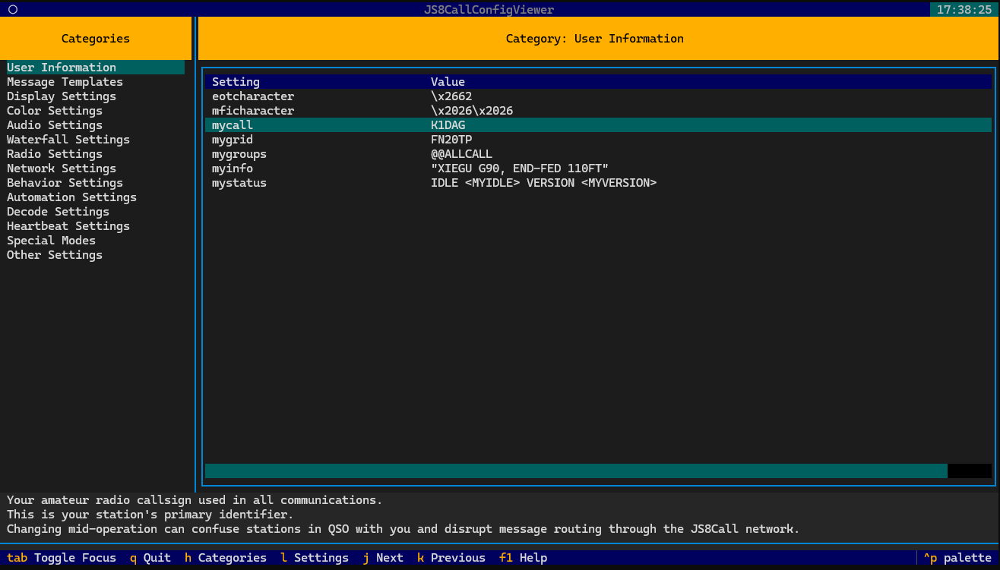

# JS8Call Configuration Viewer

A full-screen terminal user interface (TUI) application that reads and displays the JS8Call.ini configuration file with an interactive interface. It organizes settings into logical categories with clear descriptions for each setting, making it easier to understand your JS8Call configuration.

> **Note**: This is a **read-only** viewer. It does not allow editing of the configuration file. It's designed to help you understand your settings, not modify them.

## Video Demo

[](https://www.youtube.com/watch?v=WXjq2xoOxk4 "JS8Call Configuration Viewer Demo")

*Click the image above to watch the demo video*

## Features

- Full-screen interactive terminal interface with vim-style keyboard navigation
- Organized categories sidebar matching the JS8Call documentation structure
- Detailed information display for each setting with comprehensive descriptions
- Three-line description area showing the purpose and impact of each setting
- Cross-platform support (Windows, macOS, Linux)
- Automatic detection of JS8Call.ini file in standard locations
- Shows only documented settings by default (use `--all` to see everything)
- Highlights important settings
- Help screen with keyboard shortcuts and copyright information
- Status bar showing file path information
- Built with Python and the Textual TUI framework

## Requirements

- Python 3.6 or later
- Rich library (`pip install rich`)
- Textual library (`pip install textual>=0.27.0`)

## Cross-Platform Support

The tool automatically finds your JS8Call.ini file on any operating system:

- **Windows**: `%APPDATA%\JS8Call\js8call.ini` (usually `C:\Users\<username>\AppData\Roaming\JS8Call\js8call.ini`)
- **Linux**: `~/.config/JS8Call/js8call.ini` (expands to `/home/<username>/.config/JS8Call/js8call.ini`)
- **macOS**: `~/Library/Preferences/JS8Call/js8call.ini` (expands to `/Users/<username>/Library/Preferences/JS8Call/js8call.ini`)

If your JS8Call.ini file is in a non-standard location, you can specify the path using the `-f` option.

## Installation

### Method 1: Direct use

1. Clone or download this repository
2. Install the required dependencies:

```bash
pip install rich textual>=0.27.0
```

3. Make the script executable (optional):

```bash
chmod +x js8call_config_viewer.py
```

### Method 2: Install as a package

Install directly from the repository:

```bash
pip install .
```

This will install the `js8call-config-viewer` command to your system.

## Usage

### If installed as a script

Run the script from the terminal:

```bash
python js8call_config_viewer.py
```

### If installed as a package

Run the command:

```bash
js8call-config-viewer
```

### Command-line Options

- `-f PATH, --file PATH`: Specify a custom path to the JS8Call.ini file
  
  Example: `js8call-config-viewer -f /path/to/your/JS8Call.ini`

- `-a, --all`: Show all settings, including undocumented ones (by default, only documented settings are shown)
  
  Example: `js8call-config-viewer --all`

## Keyboard Navigation

- **Tab**: Toggle focus between categories and settings
- **h**: Focus on categories (left panel)
- **l**: Focus on settings (right panel)
- **j**: Move to next setting (down)
- **k**: Move to previous setting (up)
- **Arrow keys**: Navigate through lists and tables
- **Enter**: Select item
- **F1**: Show help screen with detailed information
- **q**: Quit application

## User Interface

The application features a clean, organized layout:

1. **Left Panel (20% width)**: Categories sidebar organized according to JS8Call documentation
2. **Right Panel (80% width)**: Settings table showing parameter names and their current values
3. **Description Area**: Three-line area below the main content showing detailed information about the selected setting
4. **Status Bar**: Shows the configuration file path and author information
5. **Footer**: Displays available keyboard shortcuts

Each setting is displayed in the table with:
1. **Setting Name**: The configuration parameter name
2. **Value**: The current value in the INI file

The description area below shows comprehensive information about what the setting does and how it affects JS8Call's behavior.

## Categories

Settings are organized into the following categories, matching the structure in the JS8Call documentation:

- User Information
- Message Templates
- Display Settings
- Color Settings
- Audio Settings
- Waterfall Settings
- Radio Settings
- Network Settings
- Behavior Settings
- Automation Settings
- Decode Settings
- Heartbeat Settings
- Special Modes

## Important Note

This application is a **viewer only** and does not provide any editing capabilities. To modify your JS8Call settings, use the JS8Call application itself or edit the JS8Call.ini file directly when JS8Call is not running.

## Why Filter Undocumented Settings?

By default, the tool only shows settings that are documented in the JS8Call.ini reference. This helps to:

1. Reduce clutter and focus on the most important settings
2. Ensure that all displayed settings have proper explanations
3. Prevent confusion from internal or deprecated settings

If you need to see all settings including undocumented ones (for debugging or advanced customization), use the `--all` flag.

## Credits

© 2023-2024 Tiran Dagan (tiran@tirandagan.com)  
All rights reserved. 